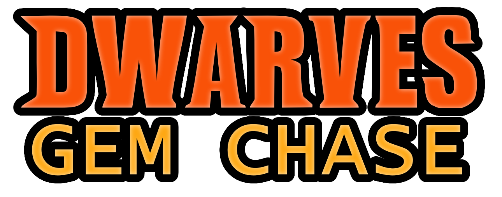

# Boardgame

## Dwarves - Gem Chase

The board game made by Group 6 2024 for game design class, Hamar Game School

## Workshop code

3242866451

## Install Instructions

> Clone this directory into "~/Documents/My Games/"

> Rename "Tabletop Simulator" to "Tabletop Simulator_old"

> Rename "Tabletop-Simulator" to "Tabletop Simulator"

> Launch Tabletop Simulator.exe via Steam. Press Create -> Singleplayer -> Save & Load -> Dwarves - Gem Chase -> Load

> To write scripts, select System in the chat and type **ui_panel_main on**, then go to Modding (top of the window) -> Scripting

## Help

Please refer to the following document if you get stuck: https://kb.tabletopsimulator.com/custom-content/importing-mods/

This document is also helpful: https://kb.tabletopsimulator.com/getting-started/technical-info/

There is a great guide for how to use the different tools found in Tabletop Simulator (such as the snapping tool) here: https://kb.tabletopsimulator.com/game-tools/snap-point-tool/

To run custom commands (such as **ui_panel_main on**) see this document: https://api.tabletopsimulator.com/systemconsole/ 

You can also contact group members, don't be afraid to ask and communicate.

## Save changes

To save changes, you can open the chat, click the system tab, and type **save dwarves "Dwarves - Gem Chase"**. This will save your changes to Saves/dwarves.json

You may then upload your changes to GitHub.

## Loading custom 3D assets

Open the main panel (**ui_panel_main on**), and select Objects and then Components. Select Custom, then Model. Select where you want the object on the virtual table, then press Escape to open an editing screen for the asset. Select the asset files, upload the assets to the cloud, and click Import.

## Scripting Resources

There is a good guide to scripting in Lua with Tabletop Simulator here: https://steamcommunity.com/sharedfiles/filedetails/?id=714904631

There is also a official guide here: https://api.tabletopsimulator.com

## How to change scripts

The scripts used in the game are found in the Scripts folder. Scripts/main.lua nad Scripts/ui.xml will be used to generate the savefile Saves/dwarves.json

To activate the build system, simply run make

> make

If you are new to unix, I recommend Git for Windows. Open bash shell, go to this directory and type the following to generate dwarves.json

> mingw32-make.exe

If you do not like unix, you can find other ways to write and modify the code.

# Brief

Deliver a finished board game (the main part of the game should be around some kind of board) based on an original idea and a written report explaining and discussing the development of the game design. You are allowed to be inspired by other board games, but are not allowed to straight up copy game mechanics and rules. There needs to substantiation changes done on the game design if you are inspired by another games. The boardgame can be made either as a digital version or a physical version. 

## General info about the board game:

Instruction book / booklet on rules, goals, age, number of players, loss conditions and other necessary information (such as how many pieces, cards, how a round of play takes place, etc.) must be present in the game. The rules of board games should be simple and understandable. There should be no confusion around the rules of the game!  The focus should be on making a fun game that has good game mechanics and gameplay. It should be evident when playing the game that it is made by people how a basic understanding of gamedesign. The game should not all be based on chance and RNG (random number generator), as this gives the player little to none possibility to plan winning strategies or affect the outcome of the game. 

The digital version of the board boardgame must be made in Tabletop simulator (TSS) https://store.steampowered.com/app/286160/Tabletop_Simulator/Links to an external site.. It is expected that the group makes the visual assets used in the board game (pictures, 3D models) but some readymade assets are allowed. The boardgame in Tabletop simulator should have a easy to understand rules sheet, boardsetup and interface. The game should be easy to play over Tabletop Simulator for 2 players or more.   

There should also be present a game board (s), game pieces and other accessories needed to play the game in TSS (the number of pieces must be in the rules). Everything must be sorted and delivered in TSS in such a fashion that one can start the game without having to sort everything or acquire plugins etc.. The game should be ready to be played when it is submitted as a finished, purchased board game on TSS. It is allowed to use other support features of TSS to better explain the rules and phases of the game.

The physical version of the boardgame must have board(s), game pieces, cards, rulebook and other accessories needed to play the game (the number of pieces must be in the rules). Everything must be sorted and delivered  in such a fashion that one can start the game without having to sort everything. The game should be ready to be played when it is submitted as a finished, purchased board game in a store. 

## How to turn in the the digital version (Tabletop simulator) boardgame for the exam: The groups doing a digital version should turn in 2 parts.

1. One is a save version of the game, with all the assets need to load the game in TSS. Look under : Tabletop simulator on for help how to do that. It is important the saved version follow the folder structure need to be successfully loaded by the graders. The zip fil for game should be named the group nr (Group 1.zip). In that zip file there should be 2 folders: Saves and Mods. In  the Mods folder, there needs to be three other folders – Images, Models, and Workshop. Make sure all pictures and models are saved here and can be imported. Make sure the save state is at the start of the game. Also the group is responsible to test if one groupmember can use the zip file, import it into TTS locally and load it. (as a backup, the group are also allowed to include a link to the Steamworks version of the game. BUT YOU ARE NOT ALLOWED TO JUST TURN IN THE LINK, AS THIS IS A CLOUD VERSION OF THE GAME AND CAN BE CHANGED AFTER EXAM DATE) 

2. Make a screengrab video of the game being played, explaining the gameplay, rules and phases. Use software like OBS to do the recording https://obsproject.comLinks to an external site.. It should not  

Both parts (TTS game and video) need to be transferred to a USB flash drive and turned in at the exam office. The group number must be written on the flash drive

## How to turn in the the physical version (Tabletop simulator) boardgame for the exam.

All parts of the boardgame (rules, board, cards, dice, gamepieces. etc) need to turned in at the exam office. It is important that everything is sorted and stored in suitable containers so the game ready to be played. The group number must be marked on the boardgame

## Report (written by the entire group):

The report should be on 2400-5000 words, with line spacing 1 ½, Times New Roman clause 12 and with page margins of 2.5 cm. Front page, table of contents and literature list do not count on the page number.

The text should mention:

Explain the mindset behind the design of all game parts (gameplay, rules, game pieces, etc.)

Testing and changes that were made / problems with the design.

Challenges and solutions when making the game.

Sources of inspiration.

Discussing the gameplay and its parts

Use the syllabus where necessary.

Emphasis will be placed on having references to the syllabus in the text as well as explaining the work process and the thoughts behind the design. The report must use approved templates for reference use and literature list (APA).

If the group have made either the digital and the physical boardgame, they also need to turn in a physical version of the report. The group number must be on the front page. 

It is important that the digital version of the boardgame on an USB flash drive or the physical version of the boardgame, with the report is turned in at the exam office at Hamar on 12 May before 12:00 oclock 

# Sources

Dwarf Warrior
by Northcliffe is licensed under the Creative Commons - Attribution license. The model was changed to hold hands out and the axe was removed: https://sketchfab.com/3d-models/dwarf-warrior-b9fcc240bc0642649d39a8ca845b56aa

Low Poly Stylized Gemstone
by Discover is licensed under the Creative Commons - Attribution license. https://sketchfab.com/3d-models/low-poly-stylized-gemstone-2a214ed3eff54148a86229ea5bb4ff31

Dragon Egg
by SkinRender is licensed under the Creative Commons - Attribution license. https://sketchfab.com/3d-models/dragon-egg-95f90e93a7cc4bce8e813411e0c53483

Gold texture from rawpixel.com - Free public domain CC0 photo. https://www.rawpixel.com/image/5960574/free-public-domain-cc0-photo

Fabric texture from pickpik.com - Royalty Free. https://www.pickpik.com/len-fabric-texture-textiles-pattern-background-33158

HDRI Panorama Skybox by macsix - Creative Commons Attribution-Share Alike 3.0 License. https://www.deviantart.com/macsix/art/Another-Sunset-Spherical-HDRI-Panorama-Skybox-416312310
